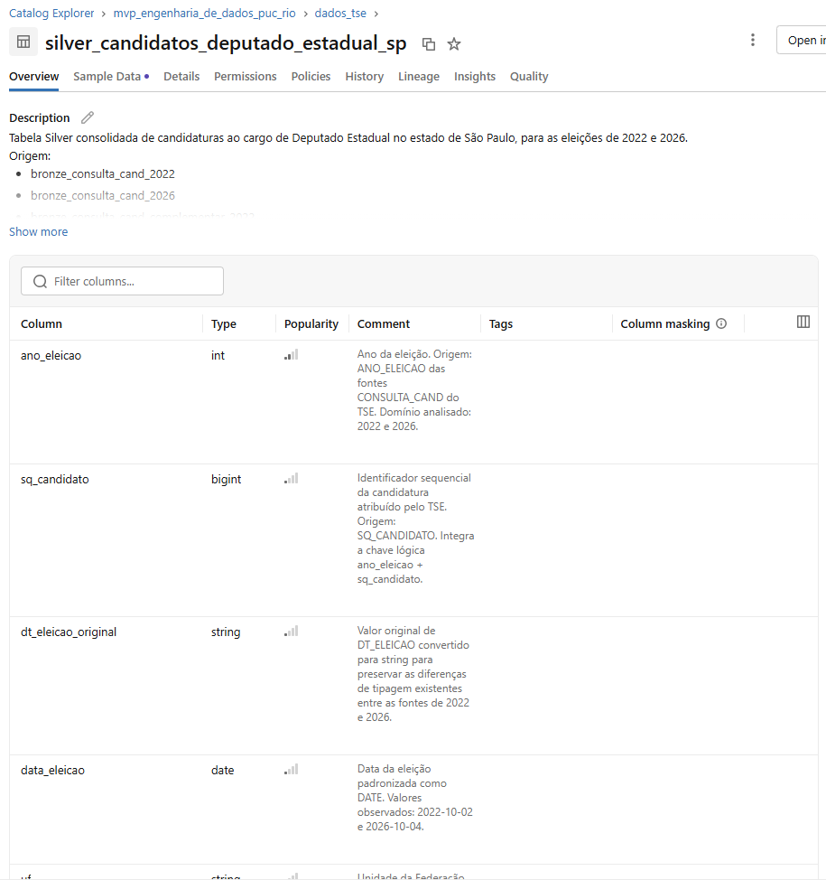
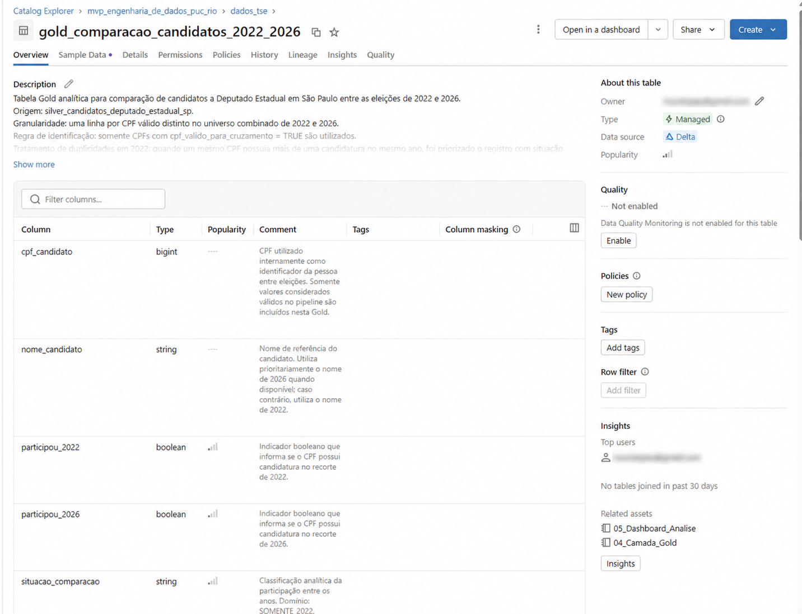
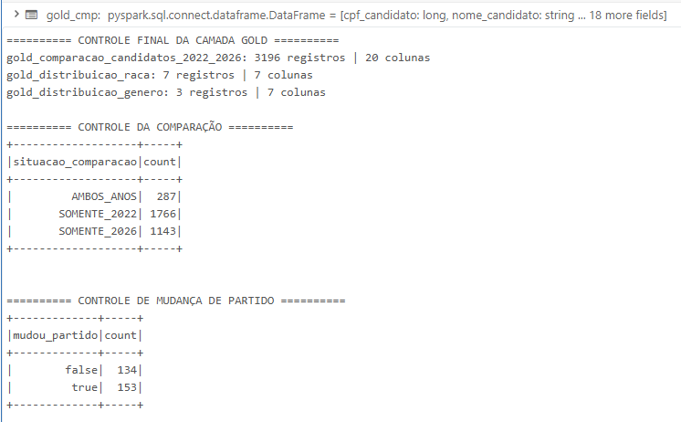
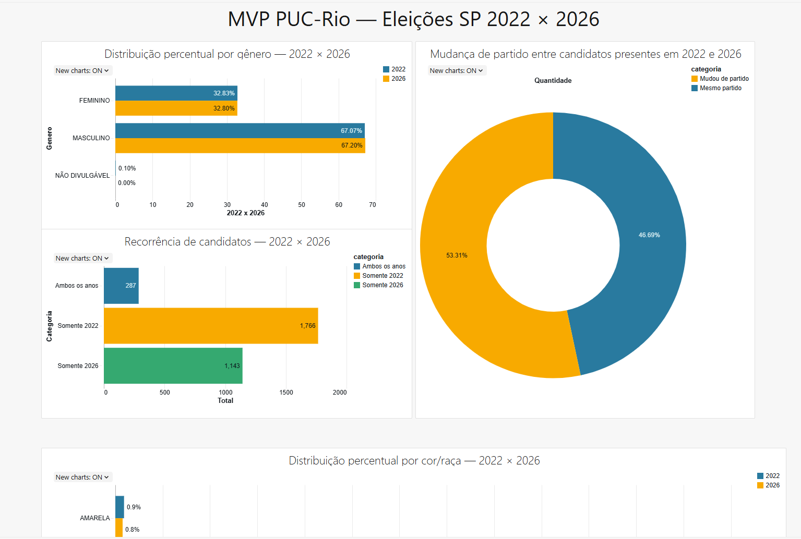
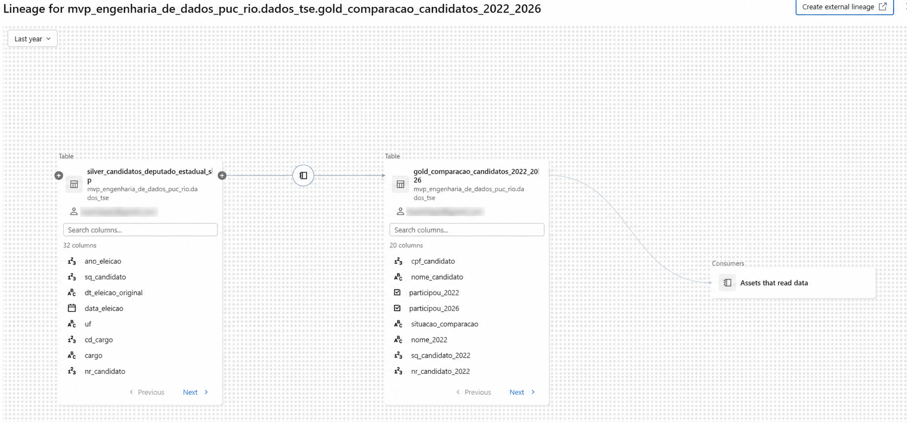

# MVP Engenharia de Dados — PUC-Rio

Pipeline de dados em Databricks para analisar candidaturas a Deputado Estadual no estado de São Paulo entre as eleições de 2022 e 2026.

## 1. Contexto de Negócio e Objetivo

O MVP organiza dados públicos do Tribunal Superior Eleitoral (TSE) em uma arquitetura Bronze, Silver e Gold. O objetivo é disponibilizar uma base analítica confiável para comparar candidaturas de 2022 e 2026, responder perguntas de perfil e recorrência e documentar a linhagem dos dados no Unity Catalog.

O recorte considera candidaturas ao cargo de Deputado Estadual no estado de São Paulo (`CD_CARGO = 7`). Para as análises de perfil, a população é formada por todos os registros de candidatura disponibilizados pelo TSE: 2.059 em 2022 e 1.430 em 2026. A análise não mede resultados eleitorais.

A situação de candidatura é preservada como atributo. Não foi aplicado filtro apenas para `APTO`, pois o arquivo de 2026 apresenta a situação como `#NE`; esse valor não é interpretado como aptidão.

## 2. Perguntas de Negócio

- Como variou a distribuição de candidaturas por cor/raça entre 2022 e 2026?
- Como variou a distribuição de candidaturas por gênero entre os dois anos?
- Quantos candidatos de 2026 não aparecem em 2022?
- Quantos candidatos de 2022 não aparecem em 2026?
- Quantos candidatos estiveram presentes nas duas eleições?
- Entre os candidatos presentes nos dois anos, quantos mudaram de sigla partidária?

## 3. Fonte e Carga dos Dados

A fonte é o Portal de Dados Abertos do TSE, a partir dos dados de candidaturas e dos arquivos complementares utilizados no pipeline. Os conjuntos de candidatos podem ser consultados no [Portal de Dados Abertos do TSE](https://dadosabertos.tse.jus.br/dataset/?groups=candidatos). A página do conjunto `Candidatos - 2026` informa a licença Creative Commons Atribuição.

Foram utilizados quatro arquivos do recorte de São Paulo:

- `consulta_cand_2022_SP.csv`
- `consulta_cand_complementar_2022_SP.csv`
- `consulta_cand_2026_SP.csv`
- `consulta_cand_complementar_2026_SP.csv`

Os arquivos foram carregados em um Volume do Unity Catalog e lidos com cabeçalho, separador `;`, codificação `ISO-8859-1` e tratamento de campos entre aspas. A Bronze preserva a estrutura recebida; as normalizações pertencem à Silver.

Os arquivos brutos não são versionados neste repositório. Também não são publicados CPFs individuais: eles são usados apenas internamente como identificador técnico para o cruzamento entre eleições.

## 4. Arquitetura da Solução

```text
4 arquivos CSV do TSE
   ↓
Volume dados_originais no Unity Catalog
   ↓
Bronze — 4 tabelas Delta que preservam as fontes
   ↓
Silver — filtros, padronização e enriquecimento
   ↓
Gold — tabelas analíticas e comparativas
   ↓
Dashboard — análises visuais

Unity Catalog — Data Catalog e linhagem
```

## 5. Modelagem e Catálogo de Dados

As tabelas principais foram documentadas no Unity Catalog com descrição, origem, granularidade, regras e comentários de colunas.

A Silver possui uma linha por candidatura e ano eleitoral, identificada logicamente por `ano_eleicao + sq_candidato`. A Gold de comparação possui uma linha por CPF válido distinto no universo combinado dos dois anos; as duas Gold de distribuição possuem uma linha por categoria analisada.

| Camada | Tabela | Finalidade |
|---|---|---|
| Silver | `silver_candidatos_deputado_estadual_sp` | Base consolidada de candidaturas, com 3.489 registros e 32 colunas. |
| Gold | `gold_comparacao_candidatos_2022_2026` | Comparação entre anos por CPF válido distinto, com 3.196 registros e 20 colunas. |
| Gold | `gold_distribuicao_raca` | Distribuição de candidaturas por cor/raça. |
| Gold | `gold_distribuicao_genero` | Distribuição de candidaturas por gênero. |





## 6. Pipeline de Dados (ETL)

### 6.1 Organização do processo e referência aos scripts

O pipeline foi ramificado em notebooks numerados, cada um com uma responsabilidade definida. A separação permite reexecutar uma etapa sem misturar ingestão, transformação, modelagem, análise e documentação.

| Etapa | Notebook | Responsabilidade |
|---|---|---|
| Exploração | [`01_Exploracao_Dados_TSE.ipynb`](notebooks/01_Exploracao_Dados_TSE.ipynb) | Exploração da fonte e definição do recorte analítico. |
| Carga Bronze | [`02_Camada_Bronze.ipynb`](notebooks/02_Camada_Bronze.ipynb) | Carga das quatro fontes brutas como tabelas Delta. |
| Transformação Silver | [`03_Camada_Silver.ipynb`](notebooks/03_Camada_Silver.ipynb) | Padronização, enriquecimento e controles da camada consolidada. |
| Modelagem Gold | [`04_Camada_Gold.ipynb`](notebooks/04_Camada_Gold.ipynb) | Construção das tabelas orientadas às perguntas de negócio. |
| Dashboard | [`05_Dashboard_Analise.ipynb`](notebooks/05_Dashboard_Analise.ipynb) | Consumo das tabelas Gold para análise e visualização. |
| Catálogo e linhagem | [`06_Data_Catalog_Documentacao.ipynb`](notebooks/06_Data_Catalog_Documentacao.ipynb) | Documentação das tabelas e verificação da linhagem no Unity Catalog. |

A execução segue a ordem dos notebooks: cada camada persiste suas tabelas Delta no Unity Catalog antes que a etapa posterior faça a leitura. Isso mantém o dado bruto rastreável, isola as regras de transformação e entrega ao dashboard apenas dados modelados para consumo analítico.

### 6.2 Bronze

A etapa de extração e carga lê os quatro CSVs do TSE no Volume `dados_originais` e os materializa como tabelas Delta. A Bronze preserva a origem, inclusive as diferenças de estrutura entre candidaturas e informações complementares, sem aplicar filtros ou deduplicação de negócio. Assim, ela funciona como referência para reprocessamento e auditoria das decisões tomadas nas camadas seguintes.

| Tabela Bronze | Registros | Colunas |
|---|---:|---:|
| `bronze_consulta_cand_2022` | 3.659 | 50 |
| `bronze_consulta_cand_2026` | 2.626 | 50 |
| `bronze_consulta_cand_complementar_2022` | 3.659 | 49 |
| `bronze_consulta_cand_complementar_2026` | 2.626 | 49 |

### 6.3 Silver

A Silver consolida os dados de 2022 e 2026, filtra o recorte de Deputado Estadual em São Paulo, padroniza tipos e datas e enriquece as candidaturas com a fonte complementar por `ano_eleicao + sq_candidato`. O objetivo dessa etapa é transformar arquivos de origem em uma tabela de candidaturas consistente, ainda no nível de detalhe de uma candidatura por ano eleitoral.

A diferença de tipo do campo de data entre as fontes foi tratada para gerar `data_eleicao` em formato padronizado. Os valores confirmados foram `2022-10-02` e `2026-10-04`.

A camada também cria o indicador `cpf_valido_para_cruzamento`: somente valores de CPF maiores que zero são usados na comparação entre eleições. Os registros com valor especial do TSE são preservados na Silver, mas não participam do cruzamento. O enriquecimento com a fonte complementar foi validado como 1:1, sem registros sem correspondente.

### 6.4 Gold

A Gold carrega dados já transformados da Silver e os modela para responder diretamente às perguntas de negócio. Ela materializa as tabelas de comparação de candidatos entre anos, distribuição por cor/raça e distribuição por gênero; essas três tabelas são as únicas fontes do dashboard.

Para a comparação orientada à pessoa, a regra de deduplicação é aplicada apenas na Gold. Em 2022, quando o mesmo CPF válido possui mais de uma candidatura, é priorizado o registro `APTO` e com detalhe `DEFERIDO`. Em seguida, um `full outer join` entre 2022 e 2026 classifica cada pessoa como `SOMENTE_2022`, `AMBOS_ANOS` ou `SOMENTE_2026`.

### 6.5 Raciocínio do ETL: do dado bruto ao consumo analítico

1. **Extrair e carregar:** os arquivos de candidaturas e complementares são recebidos do TSE e carregados no Volume do Unity Catalog; a Bronze os preserva como evidência da fonte.
2. **Padronizar e enriquecer:** a Silver aplica o recorte de negócio, trata formatos e datas, consolida os anos e realiza o cruzamento 1:1 com os dados complementares. Nessa etapa, as regras de qualidade são verificadas antes de qualquer agregação.
3. **Modelar para análise:** a Gold muda a granularidade quando necessário: preserva a comparação por pessoa com CPF válido e cria distribuições por categoria para cor/raça e gênero. A deduplicação é mantida nessa camada para não alterar o histórico de candidaturas da Silver.
4. **Consumir com rastreabilidade:** o dashboard lê somente as três Gold, evitando repetir regras de cálculo na visualização. A linhagem no Unity Catalog permite acompanhar o caminho entre a tabela consolidada, as tabelas Gold e o notebook de dashboard.

A persistência e a validação das tabelas Gold estão evidenciadas abaixo e as telas do Data Catalog, na seção de modelagem, documentam as tabelas publicadas na plataforma.



## 7. Qualidade dos Dados

Os controles aplicados incluem:

- validação do recorte de cargo, UF e ano eleitoral;
- padronização de datas e tipos entre as fontes;
- unicidade da chave lógica `ano_eleicao + sq_candidato` na Silver;
- completude dos campos críticos de identificação e análise;
- validação do enriquecimento 1:1 com a fonte complementar;
- deduplicação lógica somente na Gold, para comparação por CPF válido;
- preservação das categorias originais, inclusive categorias com quantidade zero;
- proteção de dados pessoais: CPFs não são publicados no repositório.

A validação final da Silver confirmou 3.489 registros, 3.489 chaves lógicas distintas, nenhum nulo nos campos críticos e nenhum registro sem correspondente complementar. A validação da Gold confirmou 3.196 registros na tabela de comparação, 7 categorias em `gold_distribuicao_raca` e 3 categorias em `gold_distribuicao_genero`.

Em 2022, dois registros possuem o valor especial `-4` para CPF. Eles permanecem nas camadas de candidatura, mas são excluídos exclusivamente da comparação entre pessoas. Em 2026, a situação `#NE` é mantida como informação de origem, sem ser convertida para `APTO`.

## 8. Análise e Resultados

A recorrência utiliza CPF válido distinto, enquanto os perfis de cor/raça e gênero usam o conjunto completo de candidaturas. Foram identificadas 2.053 pessoas com CPF válido distinto em 2022, 1.430 em 2026 e 3.196 no universo combinado.

### 8.1 Cor/Raça

| Categoria | 2022 | % 2022 | 2026 | % 2026 | Variação |
|---|---:|---:|---:|---:|---:|
| Branca | 1.324 | 64,30% | 956 | 66,85% | +2,55 p.p. |
| Preta | 274 | 13,31% | 170 | 11,89% | -1,42 p.p. |
| Parda | 433 | 21,03% | 285 | 19,93% | -1,10 p.p. |
| Amarela | 19 | 0,92% | 11 | 0,77% | -0,15 p.p. |
| Indígena | 6 | 0,29% | 8 | 0,56% | +0,27 p.p. |
| Não informado | 1 | 0,05% | 0 | 0,00% | -0,05 p.p. |
| Não divulgável | 2 | 0,10% | 0 | 0,00% | -0,10 p.p. |

As categorias especiais são mantidas para transparência. A ausência de registros em 2026 não é interpretada como equivalência semântica entre categorias.

### 8.2 Gênero

| Categoria | 2022 | % 2022 | 2026 | % 2026 | Variação |
|---|---:|---:|---:|---:|---:|
| Masculino | 1.381 | 67,07% | 961 | 67,20% | +0,13 p.p. |
| Feminino | 676 | 32,83% | 469 | 32,80% | -0,03 p.p. |
| Não divulgável | 2 | 0,10% | 0 | 0,00% | -0,10 p.p. |

A composição por gênero foi estável no período, ainda que as quantidades absolutas tenham diminuído.

### 8.3 Recorrência de candidatos

| Situação | Quantidade |
|---|---:|
| Somente 2022 | 1.766 |
| Ambos os anos | 287 |
| Somente 2026 | 1.143 |

### 8.4 Mudança de partido

Entre os 287 candidatos presentes nos dois anos, 153 (53,31%) mudaram de sigla partidária e 134 (46,69%) permaneceram na mesma sigla. A mudança é definida exclusivamente como diferença entre `sigla_partido` em 2022 e 2026 para o mesmo CPF válido.

## 9. Dashboard

O dashboard consolida recorrência de candidatos, mudança de partido e distribuições de cor/raça e gênero. Ele consome somente as três tabelas Gold, sem consulta direta às camadas Bronze ou Silver.



## 10. Linhagem dos Dados

A linhagem documentada no Unity Catalog evidencia a transformação de `silver_candidatos_deputado_estadual_sp` para as tabelas Gold e o consumo analítico posterior pelo notebook de dashboard.



## 11. Limitações

- Os dados representam o recorte e o momento de coleta definidos no MVP; os dados de candidatura podem ser atualizados pelo TSE.
- A análise trata candidaturas, não resultados eleitorais.
- Em 2026, a situação de candidatura estava disponível como `#NE`; por isso ela não é comparável diretamente à classificação disponível em 2022.
- O cruzamento entre eleições é limitado aos CPFs considerados válidos pelo pipeline.
- As análises de perfil usam registros de candidatura; a análise de recorrência usa pessoas identificadas por CPF válido distinto.
- Dados brutos e identificadores pessoais não são disponibilizados publicamente.

## 12. Autoavaliação

O objetivo definido para o MVP — estruturar um pipeline em nuvem que transforma dados brutos do TSE em tabelas analíticas para comparar candidaturas de Deputado Estadual em São Paulo entre 2022 e 2026 — foi atingido. Foram entregues a carga em nuvem, as camadas Bronze, Silver e Gold, os controles de qualidade, o Data Catalog, a linhagem e o dashboard que responde às perguntas de negócio inicialmente delimitadas.

Durante a avaliação e a modelagem dos dados, surgiram novas perguntas de negócio que podem enriquecer o portfólio: avaliar os resultados das eleições; verificar, entre os candidatos eleitos, os percentuais por gênero e por raça/cor; e analisar se algum candidato alterou a raça/cor autodeclarada entre eleições. Essas perguntas não fazem parte do escopo final deste MVP e ficam registradas como evolução, pois exigem ampliar a modelagem e as análises atualmente entregues.

A maior dificuldade foi aprender a utilizar o Databricks e a linguagem adotada nos notebooks enquanto, ao mesmo tempo, era desenvolvido o raciocínio de ponta a ponta para o pipeline. A Inteligência Artificial foi utilizada como apoio à organização do projeto e à resolução de parte da codificação no Databricks; as regras de transformação, os resultados e as evidências foram verificados na plataforma.

Como próximos passos, o projeto pode incorporar os dados de resultados eleitorais, testes automatizados de qualidade, execução agendada, atualização periódica das fontes e novas dimensões analíticas sobre as tabelas Gold.

## 13. Estrutura do Repositório

```text
mvp-engenharia-de-dados-puc-rio-eleicoes-sp/
├── README.md
├── notebooks/
│   ├── 01_Exploracao_Dados_TSE.ipynb
│   ├── 02_Camada_Bronze.ipynb
│   ├── 03_Camada_Silver.ipynb
│   ├── 04_Camada_Gold.ipynb
│   ├── 05_Dashboard_Analise.ipynb
│   └── 06_Data_Catalog_Documentacao.ipynb
├── docs/
│   └── prints/
│       ├── 01_validacao_final_gold.png
│       ├── 02_dashboard_final.png
│       ├── 03_data_catalog_silver.png
│       ├── 04_data_catalog_gold.png
│       └── 05_lineage_gold.png
└── data/
    └── README.md
```
